# Assembly of the DNAir sampler
## Tools and parts
The picture below gives you an overview of the tools and parts you'll need to build the DNAir sampler for collecting environmental DNA. Printable 3D files are in the [3D-files folder](./3D-files). Additionally, you'll need two plastic 6804 ball bearings and three 0.3 mm 8x10 cm polysterene blades per sampler. Not pictured but good to have around are a ruler and powdered graphite with a brush, for lubrication. Also not pictured is a stereolithography 3D printer.

## Steps

### 01 Join ball bearings and blade holders
Glue the ball bearings into the printed blade holders. For better bonding, roughen the contact surfaces first. I used cyanoacrylate 'super' glue. Time will tell if this is the best glue to weather the elements. The ball bearings have a top side (only outer and inner ring show) and a bottom side (placeholder balls also shows). Glue the ball bearings such that the top sides face outward. The bladeholders will be oriented such that they slant downwards.

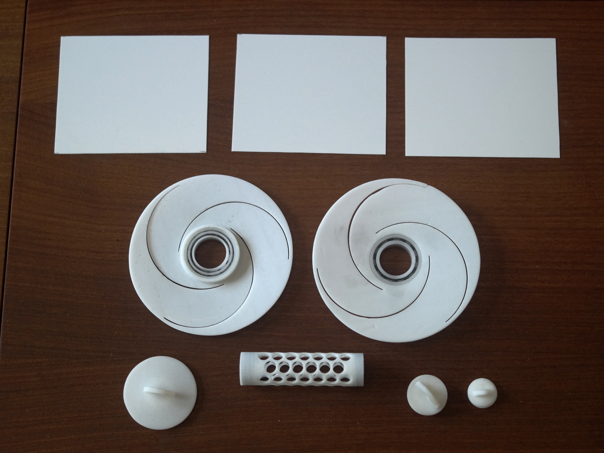

### 02 Glue the closing screw to the lower blade holder
Glue the 'closing screw bottom' part to the ball bearing of the bottom blade holder. Again, roughen the contact surfaces first. I find it hard to apply the exact right amount of glue, so I overdo it a little and then use a q-tip to soak up the excess glue. The q-tip has a nasty chemical reaction to the ca glue (gets all hot, bad fumes) so be careful! I always wear a mask and gloves. A trick to align the bottom screw part properly is to screw in the core part to the bottom part, and then push the core plus screw through the central hole in the ball bearing until the contact surfaces meet. It sets quickly and you can easily unscrew the core part next.

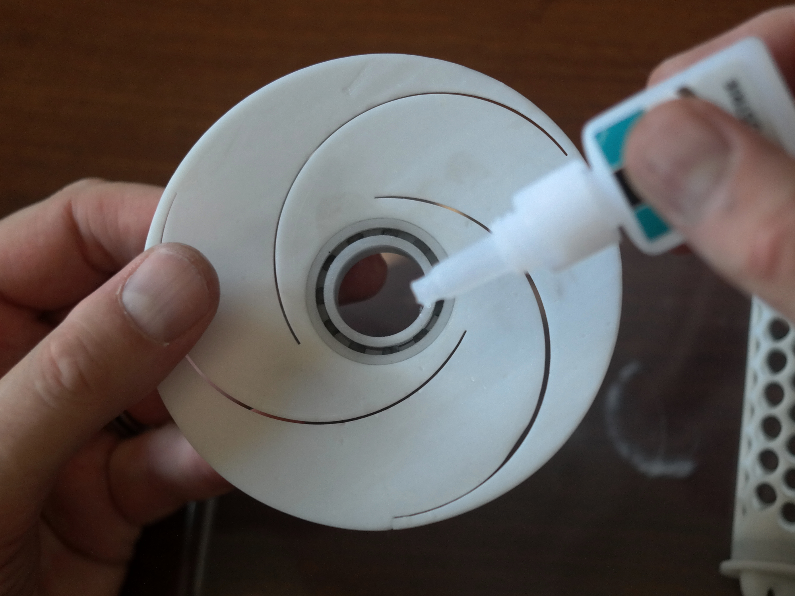
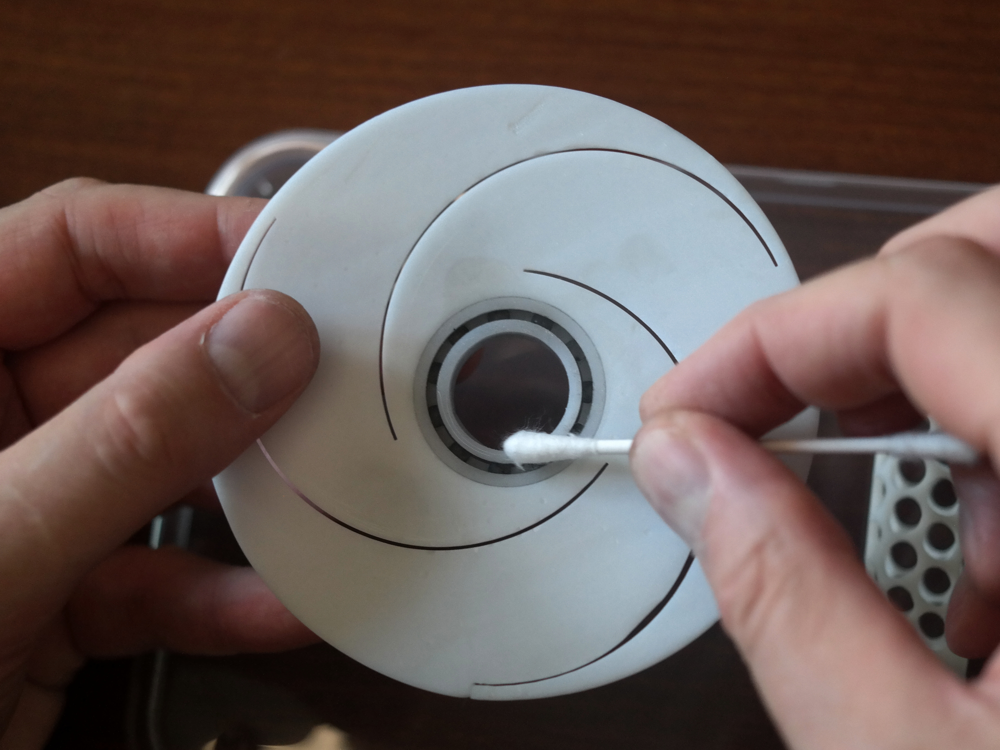
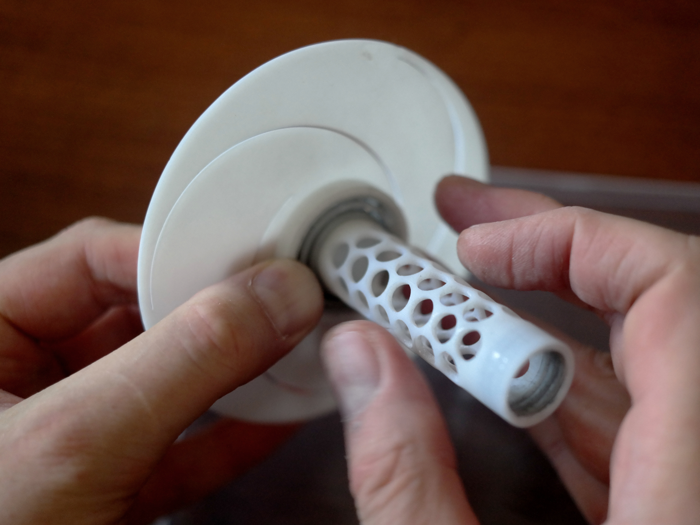

### 03 Insert and fix the blades
Insert the blades; both blade holders should slant slightly downward, to drain moisture in a real-world setting. The slits in the bladeholders are a little over 10 cm wide, fit the blades in so that their 10 cm sides will fit horizontally and their 8 cm sides vertically. The distance between bladeholders should be about 65 mm. If you hold the DNAir sampler-to-be by the bottom screw and give it a careful, exploratory spin, the imaginary axis between the ball bearings should stay straight and not be wobbly. Wobbly would be bad, i.e. introduce unnecessary friction in the sampler. Glue the blades in place. I glue the edges first and let it set before glueing the lengths. A little extra glue will close parts of the slits that are not filled by the blades. After all is set and done, cut of any excess length of the blades.

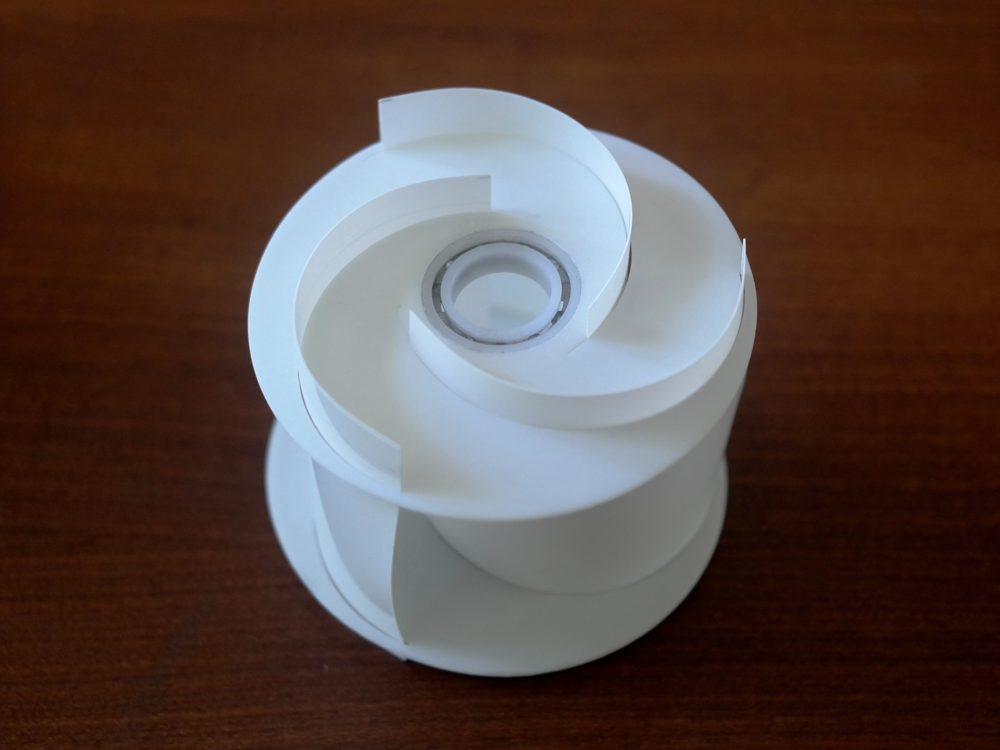
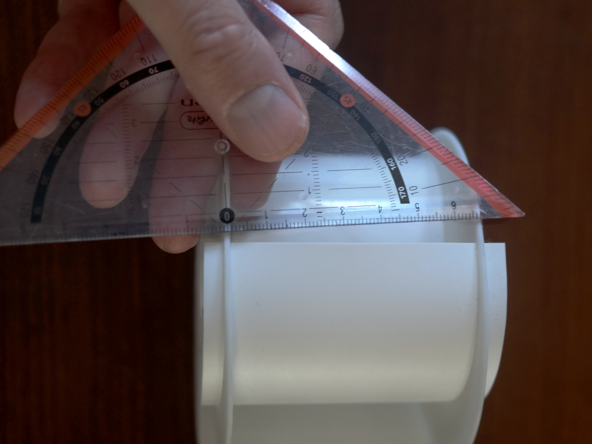
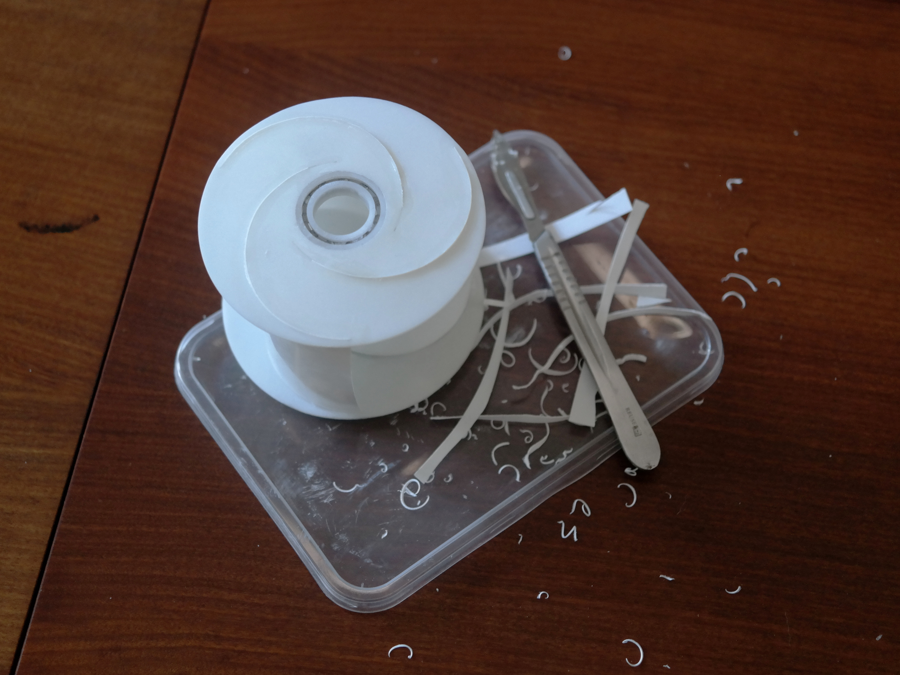

### 04 Lubrication
A lttle lubrication goes a long way to smoothen operation. I use a brush to insert graphite powder to moving parts, i.e. the ball bearings and the threads. Don't use oil, mineral or otherwise, as it may weaken the cyanoacrylate bonds.

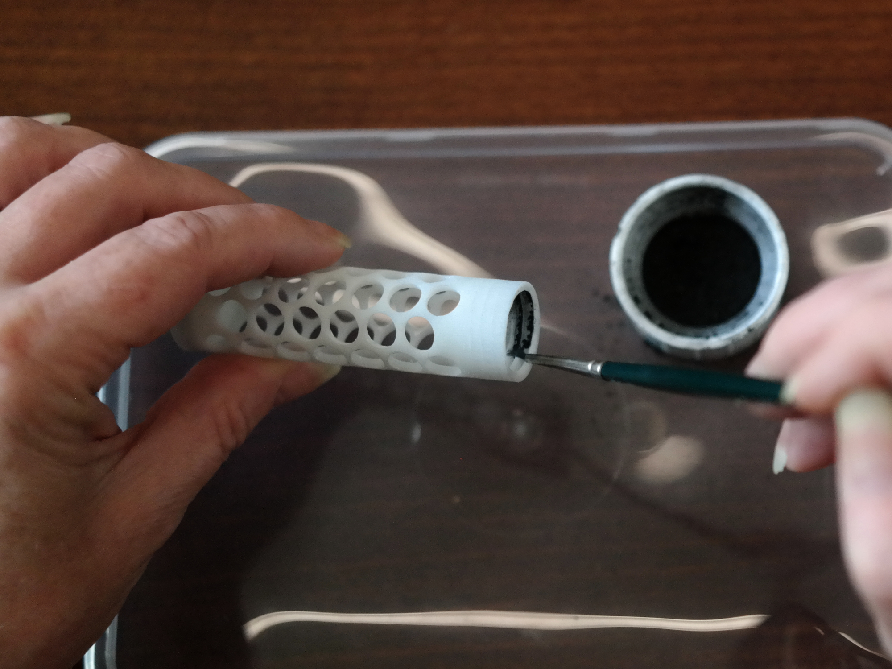
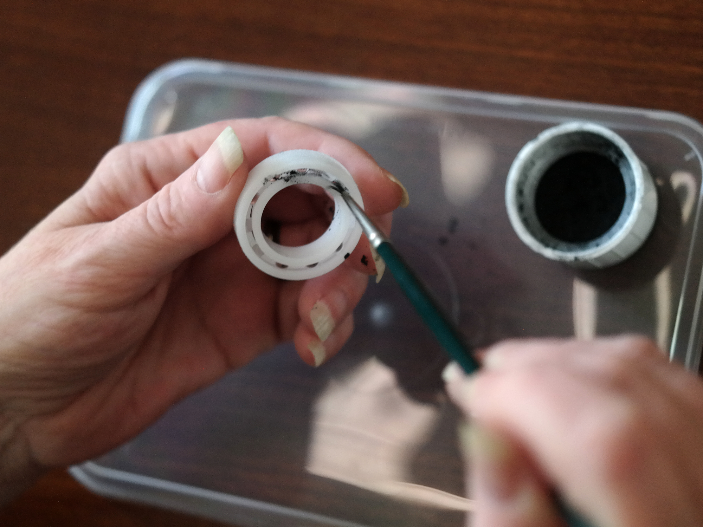

### 05 Final assembly
Insert a bit of cotton wool into the core. Close the core with the two remaining screws. Your airborne eDNA sampler is now ready for use.

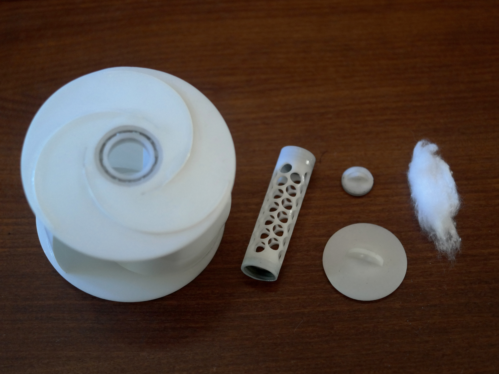
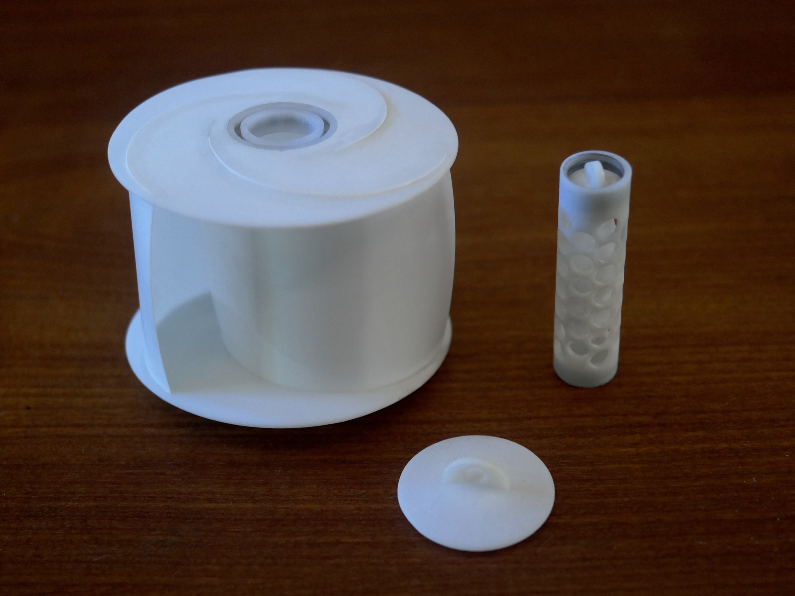
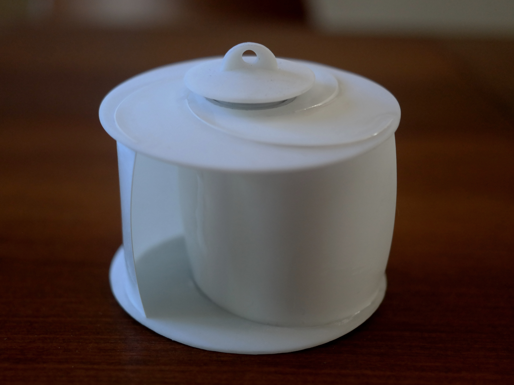

## .. and Go

https://github.com/J4n-M44rt3n/DNAir-sampler/blob/master/Media/eDNA-collector.mp4

