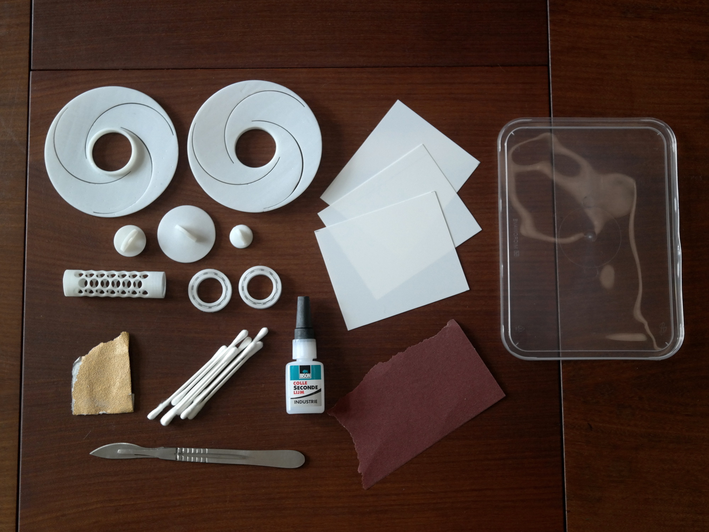
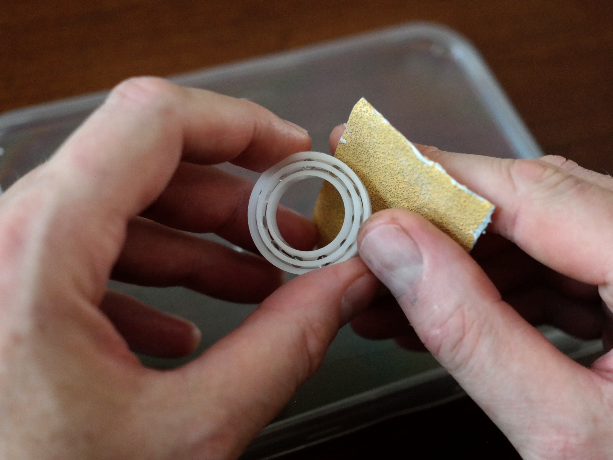
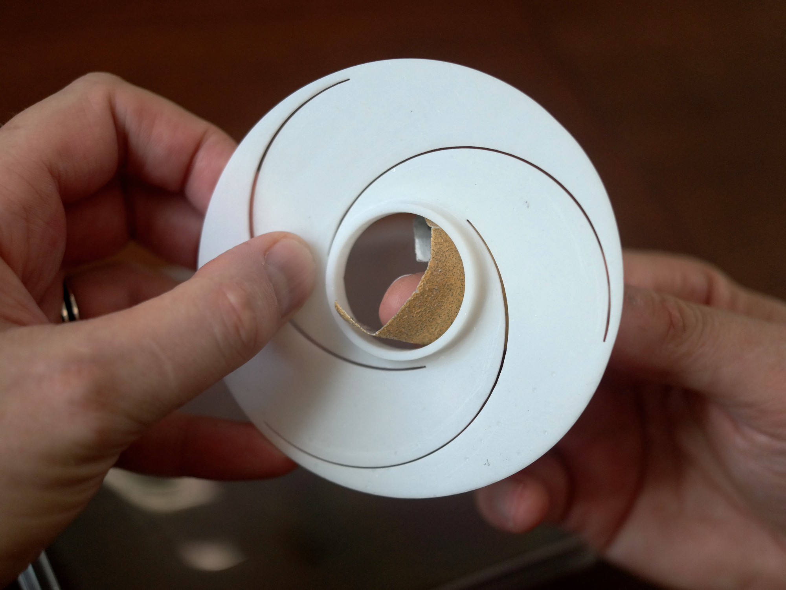

# Assembly of the DNAir sampler
## Tools and parts
The picture below gives you an overview of the tools and parts you'll need to build the DNAir sampler for collecting environmental DNA. Printable 3D files are in the [3D-files folder](./3D-files). Additionally, you'll need two plastic 6804 ball bearings and three 0.3 mm 8x10 cm polysterene blades per sampler. Not pictured but good to have around are a ruler and powdered graphite with a brush, for lubrication.

## Steps

### 01
Glue the ball bearings into the printed blade holders. For better bonding, roughen the contact surfaces first. I used cyanoacrylate 'super' glue. Time will tell if this is the best glue to weather the elements.

